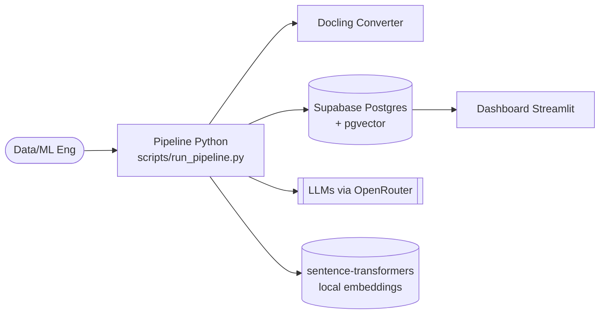
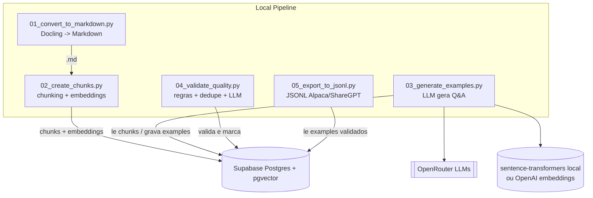

# Arquitetura — JurDatasetBrasil (arc42 + C4-lite)

Visão da arquitetura atual do pipeline de criação do dataset jurídico, com diagramas em Mermaid (renderiza no GitHub) e pontos de manutenção.

## 1. Contexto e stakeholders
- **Objetivo**: converter documentos jurídicos brutos em dataset versionado com rastreabilidade e embeddings para RAG e fine-tuning.
- **Stakeholders**: cientistas de dados/ML (pipeline), juristas/curadores (validação), engenheiros de dados (infra/Supabase).

## 2. Restricoes / premissas
- Execucao local via Python 3.10+, dependencias de `requirements.txt`.
- Supabase com pgvector habilitado (`scripts/setup_database.sql`).
- Chaves sensiveis apenas via `.env` (nao comitar).
- Execucao sequencial dos passos 1-5; nao ha orquestrador distribuido.

## 3. Visao de solucao (containers)

## 4. Componentes principais
- `scripts/config.py`: carrega `.env`, define caminhos e constantes.
- `scripts/database.py`: CRUD para `laws`, `articles`, `chunks`, `datasets`, `examples`; RPCs vetoriais `match_chunks`/`match_examples`.
- `scripts/utils/text_processor.py`: limpeza, contagem de tokens, chunking, metadados de lei.
- `scripts/utils/embedding_generator.py`: backends sentence-transformers local e OpenAI.
- `scripts/run_pipeline.py`: orquestra passos 1-5.
- `scripts/setup_database.sql`: schema pgvector e RPCs.

## 5. Fluxos de runtime
1) **Ingestao**: DOCX/PDF em `0-RawDocs` -> Docling -> Markdown em `1-MarkdownClean`.
2) **Chunking/embeddings**: quebra em sentencas, overlap configuravel, embeddings (local/OpenAI) -> `chunks` em Supabase.
3) **Geracao de exemplos**: LLM via OpenRouter gera Q&A por chunk -> `examples` (com embeddings de instrucoes).
4) **Validacao/dedupe**: regras de tamanho, similaridade (pgvector) e LLM de validacao -> marcar/limpar.
5) **Exportacao**: `examples` validados -> JSONL ShareGPT/Alpaca em `3-FinalDataset`.

## 6. Dados e modelos
- Tabelas: `laws`, `articles`, `chunks`, `datasets`, `examples`, `migrations` (detalhadas em `SCHEMA.md` e `scripts/setup_database.sql`).
- Embeddings default: `sentence-transformers/all-MiniLM-L6-v2` (384 dims); ajustar pgvector/ENV se trocar modelo.
- Relacoes chave: `chunks.law_id`/`article_id`, `examples.dataset_id`, `examples.chunk_ids` para rastreabilidade.

## 7. Segurança e conformidade
- Segredos via `.env` (`SUPABASE_*`, `OPENROUTER_API_KEY`, opcional `OPENAI_API_KEY`); nao expor em logs/commits.
- Service role key so para pipelines controlados; preferir anon key em leitura.
- Ativar RLS no Supabase para tabelas de producao; RPCs devem respeitar politicas.
- Sanitizar entrada de documentos (PDFs externos) antes de ingestao.

## 8. Qualidade e atributos
- **Rastreabilidade**: manter `metadata` e `chunk_ids` nos exemplos.
- **Precisao**: validacao por regras + LLM; ajustar `SIMILARITY_THRESHOLD` e tamanho minimo/maximo.
- **Desempenho**: usar cache de container no Codex; embeddings em batch (`batch_size` em `embedding_generator.py`).
- **Evolutividade**: configuracoes via ENV; substituicao de modelos sem alterar pipeline.

## 9. Riscos / debito
- `dataset_id` hardcoded em passos 3 e 5 (`jurdataset_v1`).
- Ausencia de flag `processed/validated` nas tabelas para controle fino.
- Falta de orquestracao paralela/retentativas robustas nos passos longos.
- Falta de testes automatizados dos scripts.

## 10. Documentacao e manutencao
- Diagramas em Mermaid (C4-lite) dentro deste arquivo; editar inline.
- Para gerar dataset: `python scripts/run_pipeline.py` ou `--step N` para passos individuais.
- Para validar qualidade periodicamente: `python scripts/run_pipeline.py --step 4`.
- Exportar dataset: `python scripts/05_export_to_jsonl.py`.
- Automatizar: usar GitHub Actions simples rodando lint + `python -m compileall` e validacao de diagramas (opcional `mermaid-cli`) quando for habilitado CI.

## 11. ADRs
- ADRs ficam em `docs/adrs/`. Ver `docs/adrs/0001-embedding-backend.md` (primeira decisao registrada).
